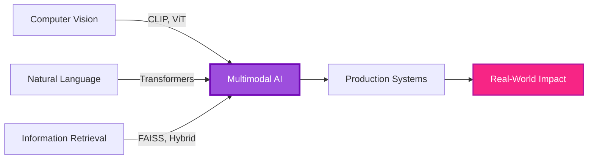

<div align="center">

# 🚀 Hatice Baydemir


<br/>

[](https://www.linkedin.com/in/haticebaydemir)
[](mailto:baydemirhatice@hotmail.com)
[](https://github.com/haticebaydemir)


</div>

---

<div align="center">

## 🎯 Mission Statement

### *"Building AI systems that understand products the way humans do—visually, semantically, and conversationally"*

</div>

---

## 👩‍💻 About Me

I'm a **Computer Engineer** and **AI Research Engineer** specializing in **multimodal intelligence systems**. My work sits at the intersection of **computer vision**, **natural language processing**, and **information retrieval**—focused on teaching machines to understand the world through multiple modalities.

Currently leading a **TÜBİTAK 2209-A funded research project** 🇹🇷 developing production-grade multimodal search and recommendation systems for e-commerce.

<table>
<tr>
<td width="50%">

### 🔥 What Drives Me
- Building **production-ready AI systems**
- Bridging **research ↔ real-world impact**
- **Vision-language fusion** architectures
- Making AI **accessible & practical**

</td>
<td width="50%">

### 🎓 Background
- 💼 **Computer Engineering**
- 🔬 **TÜBİTAK 2209-A Principal Researcher**
- 🌟 **Google Professional Certificates**
- 📊 **Full ML Lifecycle** (research → production)

</td>
</tr>
</table>

---

<div align="center">

## 🧬 Research DNA

</div>



<table>
<tr>
<td align="center" width="25%">

### 🖼️
### **Vision**
CLIP Embeddings  
Visual Similarity  
Image Understanding  

</td>
<td align="center" width="25%">

### 📝
### **Language**
Semantic Search  
Query Reformulation  
TR/EN Understanding  

</td>
<td align="center" width="25%">

### 🔍
### **Retrieval**
FAISS Vector Search  
Hybrid Ranking  
ANN Algorithms  

</td>
<td align="center" width="25%">

### 🤖
### **AI Systems**
Production Pipelines  
FastAPI Backends  
Docker Deployment  

</td>
</tr>
</table>

---

<div align="center">

## 🏆 Flagship Project: Multimodal Fashion Intelligence

### **TÜBİTAK 2209-A Research Grant** • **44,418 Products** • **Production System**


</div>

### 🎯 Project Overview

> **User-Based Multimodal E-Commerce Search & Recommendation System**  
> A production-grade AI platform that understands products through vision and language, enabling semantic search, visual similarity, and conversational discovery.

### 🏗️ System Architecture

<div align="center">

```
┌─────────────────────────────────────────────────────────────┐
│                    User Query (Text/Image)                   │
└────────────────────────┬────────────────────────────────────┘
                         │
        ┌────────────────┴────────────────┐
        │                                 │
        ▼                                 ▼
┌───────────────┐                 ┌───────────────┐
│  CLIP Vision  │                 │ Sentence BERT │
│   Encoder     │                 │  Text Encoder │
└───────┬───────┘                 └───────┬───────┘
        │                                 │
        └────────────────┬────────────────┘
                         │
                         ▼
              ┌──────────────────┐
              │  FAISS Vector DB  │
              │  (44K Products)   │
              └─────────┬────────┘
                        │
                        ▼
              ┌──────────────────┐
              │  Hybrid Ranking  │
              │  + Metadata      │
              └─────────┬────────┘
                        │
                        ▼
              ┌──────────────────┐
              │   Top-K Results  │
              │   + Chatbot UI   │
              └──────────────────┘
```

</div>

### ⚡ Core Capabilities

<table>
<tr>
<td width="33%" align="center">

### 🔍 **Semantic Search**
Zero-shot text queries  
Intent understanding  
Multilingual (TR/EN)  
Query reformulation  

</td>
<td width="33%" align="center">

### 🎨 **Visual Similarity**
Image-based retrieval  
CLIP embeddings  
Cross-modal search  
Visual reasoning  

</td>
<td width="33%" align="center">

### 🤝 **Hybrid Fusion**
Dense + sparse retrieval  
Metadata integration  
Adaptive re-ranking  
Context-aware scoring  

</td>
</tr>
<tr>
<td width="33%" align="center">

### 💬 **Conversational AI**
LLM-powered chatbot  
Natural product discovery  
Context preservation  
Personalized responses  

</td>
<td width="33%" align="center">

### 📊 **Human Evaluation**
Benchmark datasets  
Relevance assessment  
A/B testing framework  
Quality metrics  

</td>
<td width="33%" align="center">

### 🚀 **Production Ready**
FastAPI backend  
Docker deployment  
Real-time inference  
Scalable architecture  

</td>
</tr>
</table>

### 🛠️ Technical Stack

<div align="center">

**Core AI/ML**


**Vector Search & Retrieval**


**Backend & Deployment**


</div>

### 📂 Explore the Repository

<div align="center">

[](https://github.com/haticebaydemir/multimodal-ecommerce-chatbot)


</div>

---

<div align="center">

## 🔬 Research Focus & Expertise

</div>

<table>
<tr>
<td width="50%" valign="top">

### 🧠 **Multimodal AI**


- **Vision-Language Models**: CLIP, BLIP, ViT, ALIGN
- **Cross-Modal Learning**: Contrastive learning, alignment strategies
- **Embedding Spaces**: Joint vision-text representations
- **Zero-Shot Transfer**: Generalizing to unseen categories
- **Multimodal Fusion**: Early vs late fusion architectures

**Applications:**
- Image-text retrieval
- Visual question answering
- Cross-modal search
- Product understanding

</td>
<td width="50%" valign="top">

### 🔍 **Information Retrieval**


- **Dense Retrieval**: FAISS, ANN algorithms, HNSW
- **Hybrid Search**: Combining sparse + dense methods
- **Re-ranking**: Learned ranking functions, LambdaMART
- **Query Understanding**: Intent classification, reformulation
- **Evaluation**: NDCG, MRR, Precision@K, Recall@K

**Applications:**
- E-commerce search
- Semantic product discovery
- Visual similarity search
- Conversational retrieval

</td>
</tr>
<tr>
<td width="50%" valign="top">

### 📝 **Natural Language Processing**


- **Transformers**: BERT, RoBERTa, mBERT, XLM-R
- **Sentence Encoders**: SentenceTransformers, SimCSE
- **Multilingual NLP**: Turkish language models, cross-lingual transfer
- **Query Processing**: Entity recognition, query expansion
- **Semantic Similarity**: Cosine similarity, sentence embeddings

**Applications:**
- Turkish query understanding
- Cross-lingual search (TR↔EN)
- Product description analysis
- Chatbot NLU

</td>
<td width="50%" valign="top">

### 🎨 **Computer Vision**


- **CNNs**: ResNet, EfficientNet, ConvNeXt
- **Vision Transformers**: ViT, DeiT, Swin
- **Image Embeddings**: CLIP visual encoder, feature extraction
- **Visual Similarity**: Perceptual hashing, deep features
- **Data Augmentation**: Albumentations, AutoAugment

**Applications:**
- Visual product search
- Image similarity matching
- Fashion attribute extraction
- Style-based retrieval

</td>
</tr>
</table>

---

<div align="center">

## 🛠️ Technical Arsenal

</div>

<details open>
<summary><b>🧠 Machine Learning & Deep Learning</b></summary>
<br>

<div align="center">


</div>

**Expertise Areas:**
- 🎯 Transfer Learning & Fine-tuning
- ⚡ Mixed Precision Training (FP16/BF16)
- 🔄 Distributed Training (DDP, FSDP)
- 🎨 Parameter-Efficient Methods (LoRA, Adapters)
- 📊 Experiment Tracking (W&B, MLflow)
- 🧪 Model Evaluation & Validation

</details>

<details open>
<summary><b>🔍 Vector Search & Embeddings</b></summary>
<br>

<div align="center">


</div>

**Expertise Areas:**
- 🚀 Approximate Nearest Neighbors (ANN)
- 📐 HNSW, IVF, Product Quantization
- 🔗 Hybrid Search (Dense + Sparse)
- 💾 Index Optimization & Compression
- ⚖️ Semantic vs Lexical Balance
- 🎯 Re-ranking Strategies

</details>

<details open>
<summary><b>⚙️ Backend Engineering & MLOps</b></summary>
<br>

<div align="center">


</div>

**Expertise Areas:**
- 🌐 RESTful API Design
- ⚡ Async Programming (asyncio, uvloop)
- 🐳 Containerization & Orchestration
- 📊 API Monitoring & Logging
- 🔐 Authentication & Security
- 🚀 Model Serving & Inference

</details>

<details open>
<summary><b>📊 Data Science & Analytics</b></summary>
<br>

<div align="center">


</div>

**Expertise Areas:**
- 📈 Exploratory Data Analysis (EDA)
- 🔢 Statistical Testing & Validation
- 📊 Data Visualization & Storytelling
- 🧹 Data Cleaning & Preprocessing
- 🔄 ETL Pipelines
- 📉 A/B Testing & Experimentation

</details>

---

<div align="center">


### 📚 Publication Pipeline

<div align="center">

| **Venue** | **Topic** | **Status** |
|:---:|:---:|:---:|
| 🎯 **RecSys** | Hybrid Multimodal Ranking | 📝 Preparing |
| 📝 **ACL** | Turkish Query Understanding | 🔬 Experimenting |
| 🖼️ **CVPR Workshop** | Fashion Visual Search | 💡 Ideation |

</div>

---

📊 Profile Analytics
<p align="center">  </p>
---

<div align="center">

## 🤝 Let's Collaborate!

I'm passionate about **advancing multimodal AI research** and **building impactful systems**. Always open to:

</div>

<table align="center">
<tr>
<td align="center" width="25%">

### 🎓
**Research**  
Collaboration  

</td>
<td align="center" width="25%">

### 💼
**Consulting**  
Projects  

</td>
<td align="center" width="25%">

### 🎤
**Speaking**  
Opportunities  

</td>
<td align="center" width="25%">

### 🌟
**Open Source**  
Contributions  

</td>
</tr>
</table>

<div align="center">

[](https://www.linkedin.com/in/haticebaydemir)
[](mailto:baydemirhatice@hotmail.com)
[](https://github.com/haticebaydemir)
[](https://www.kaggle.com/haticebaydemir)

</div>

---

<div align="center">


### 💭 *"The future of AI is multimodal—let's build it together"* 🚀

</div>

<p align="center">

</p>
