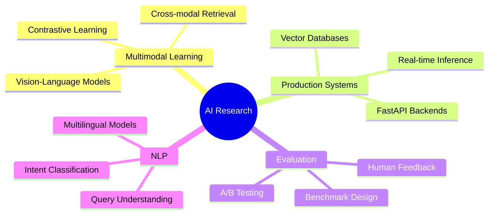

<div align="center">

# Hatice Baydemir

### AI Research Engineer | Multimodal Intelligence Systems

[](https://www.linkedin.com/in/haticebaydemir/)
[](https://github.com/haticebaydemir)
[](mailto:your.email@example.com)

</div>

---

## 👋 About Me

I'm an **AI/ML Research Engineer** specializing in **multimodal intelligence systems** that bridge the gap between vision, language, and user intent. My work focuses on developing production-grade solutions that leverage state-of-the-art deep learning architectures to solve real-world challenges in semantic understanding and information retrieval.

Currently leading a **TÜBİTAK-funded research initiative** developing next-generation multimodal search and recommendation systems for e-commerce applications.

### 🎯 Research Interests

```
🔬 Multimodal Learning          🧮 Semantic Search Architectures
🖼️  Vision-Language Models       🎨 Hybrid Retrieval Systems
🔍 Information Retrieval        🤖 Generative AI Applications
📊 Recommender Systems          🌐 Cross-lingual Understanding
```

---

## 🚀 Current Research Project

### **Multimodal E-Commerce Intelligence Platform**
*TÜBİTAK Research Grant | Production System*

> Advanced semantic search and recommendation engine leveraging vision-language models and hybrid retrieval architectures

#### 🎯 Key Innovations

- **Vision-Language Fusion**: CLIP-based multimodal embeddings for joint image-text understanding
- **Hybrid Retrieval**: Dense vector search (FAISS) + metadata-aware re-ranking
- **Intent-Aware Search**: Multilingual query understanding and reformulation (EN/TR)
- **Adaptive Ranking**: Human-evaluation driven optimization with online learning
- **Conversational AI**: LLM-powered chatbot for natural product discovery

#### 🛠️ Technical Stack


**Core Technologies**: `CLIP` · `SentenceTransformers` · `FAISS` · `FastAPI` · `Uvicorn` · `Streamlit`

#### 📂 Repository
**[multimodal-ecommerce-chatbot](https://github.com/haticebaydemir/multimodal-ecommerce-chatbot)** — Production codebase (active development)

---

## 💡 Research Contributions

### Active Research Tracks

<table>
<tr>
<td width="50%">

**🔬 Multimodal Fusion**
- Cross-modal attention mechanisms
- Vision-language alignment strategies
- Contrastive learning for retrieval

</td>
<td width="50%">

**🎯 Semantic Search**
- Dense retrieval optimization
- Hybrid ranking algorithms
- Query understanding & expansion

</td>
</tr>
<tr>
<td width="50%">

**📊 Evaluation Systems**
- Human-in-the-loop benchmarking
- Relevance assessment frameworks
- A/B testing methodologies

</td>
<td width="50%">

**🌐 Multilingual NLP**
- Cross-lingual transfer learning
- Turkish language model fine-tuning
- Intent classification (EN/TR)

</td>
</tr>
</table>

---

## 🛠️ Technical Expertise

<details open>
<summary><b>Machine Learning & Deep Learning</b></summary>
<br>


- **Vision-Language Models**: CLIP, BLIP, ViT, ALIGN
- **NLP Architectures**: BERT, GPT, SentenceTransformers, mBERT
- **Computer Vision**: CNNs, ResNet, EfficientNet, Image Encoders
- **Training Frameworks**: Distributed training, Mixed precision, LoRA/QLoRA

</details>

<details open>
<summary><b>Vector Search & Information Retrieval</b></summary>
<br>


- **Vector Databases**: FAISS, Milvus, Pinecone
- **Similarity Search**: ANN algorithms, HNSW, Product Quantization
- **Hybrid Retrieval**: Sparse + Dense fusion, Re-ranking pipelines
- **Embedding Models**: SentenceTransformers, OpenAI embeddings

</details>

<details open>
<summary><b>Backend & API Development</b></summary>
<br>


- **Web Frameworks**: FastAPI, Flask, Uvicorn, Gunicorn
- **API Design**: RESTful APIs, OpenAPI/Swagger, Async endpoints
- **Deployment**: Docker, Docker Compose, CI/CD pipelines
- **Prototyping**: Streamlit, Gradio, Jupyter notebooks

</details>

<details open>
<summary><b>Data Science & Analytics</b></summary>
<br>


- **Data Processing**: Pandas, NumPy, Polars, PySpark
- **Visualization**: Matplotlib, Seaborn, Plotly, Weights & Biases
- **Statistical Analysis**: SciPy, Statsmodels, Hypothesis testing
- **Experiment Tracking**: MLflow, Weights & Biases, TensorBoard

</details>

---

## 📊 GitHub Statistics

<div align="center">


</div>

---

## 🎓 Current Focus Areas



---

## 📫 Let's Connect

I'm always interested in collaborating on research projects, discussing AI/ML innovations, or exploring opportunities in multimodal intelligence systems.

<div align="center">

[](https://www.linkedin.com/in/haticebaydemir/)
[](https://github.com/haticebaydemir)
[](mailto:your.email@example.com)

</div>

---

<div align="center">

### 💭 *"Building intelligent systems that understand the world through multiple modalities"*


</div>

---

<p align="center">

</p>
